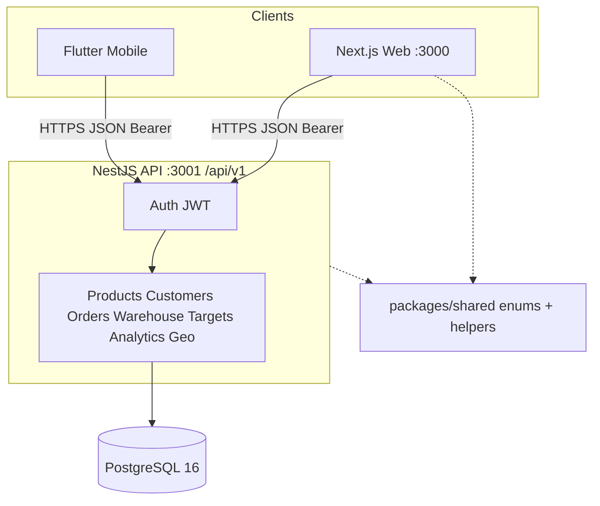

# Architecture — UMKM Hub

| Field | Value |
|-------|-------|
| **Product** | UMKM Hub |
| **Version** | 1.5.217 |
| **Date** | 2026-07-26 |

---

## 1. System overview



**Tenancy model:** JWT `sub` = `profileId`. Every domain query is scoped to that profile.

---

## 2. Repository layout

```
UMKM Hub/
├── apps/
│   ├── api/          # NestJS system of record
│   ├── web/          # Next.js ops UI
│   └── mobile/       # Flutter field client
├── packages/
│   └── shared/       # TS enums, labels, calculateOrderTotals
├── docs/             # Product & engineering documentation
├── scripts/
│   └── sync-env.sh   # Sandbox bootstrap / sync
├── docker-compose.yml
├── package.json      # Root orchestration scripts
└── README.md
```

Root scripts use `npm --prefix` (not a full Turborepo/pnpm workspace).

---

## 3. API architecture

| Concern | Implementation |
|---------|----------------|
| Framework | NestJS 11 modular controllers/services |
| ORM | Prisma 6 |
| Auth | Passport JWT; access ~15m; refresh ~7d |
| Validation | class-validator whitelist + forbid unknown |
| Errors | Global filter → `{ statusCode, error, message, timestamp }` |
| Throttling | `@nestjs/throttler` |
| Health | `GET /api/v1/health` |

### Domain modules
`auth`, `profiles`, `products`, `customers`, `orders`, `warehouse`, `revenue-targets`, `analytics`, `geo`, `prisma`, `health`

### Critical transactional paths
1. **Order create/update** — validate stock, write lines/installments, adjust `Product.stockQty`
2. **Order cancel** — restore stock for all lines
3. **Warehouse restock** — increment stock + write history snapshots

### Shared aggregation
`loadOrderActuals` powers both **Targets** and **Analytics** so attainment never drifts.

### Analytics contract
`GET /api/v1/analytics` accepts:

| Query | Values | Notes |
|-------|--------|-------|
| `years` (preferred) / `year` | omit → current UTC year; `all`; `2024,2025` | Timeline scope (`analytics-period.ts`) |
| `include` | `summary,series,products,customers` | Progressive load; omit → all |
| `granularity` | `weekly\|monthly\|quarterly\|annual\|all` | Which series to build |

Single-year annual context loads a rolling **10-year** window. In-process window cache TTL **45s** (`analytics-cache.ts`).

### Auth & profile identity
- Register requires unique username + email (case-insensitive); `POST /auth/register-availability` is anti-enumerating
- Login accepts `login` (username or email)
- Username and email immutable after register; email verify via one-time link
- Location city/country sealed (AES-GCM); IP hashed (HMAC)

---

## 4. Data model (summary)

Profile owns: Product, Customer, Order, WarehouseRestock, RevenueTargetPlan, EmailVerificationToken.  
Order has: OrderLine[], OrderInstallment[], optional Customer.  
RevenueTargetPlan has: RevenueTargetMonth[12].

Full field catalog: [VARIABLES.md](./VARIABLES.md). Schema: `apps/api/prisma/schema.prisma`.

---

## 5. Web architecture

| Concern | Implementation |
|---------|----------------|
| Framework | Next.js 15 App Router, React 19 |
| Styling | Tailwind CSS 4 + `globals.css` design tokens |
| Auth UX | Login/register/verify-email; token in client storage; `lib/api.ts` |
| Charts | Recharts (code-split; progressive panels) |
| Shell | `AppShell` (sidebar / tablet rail / phone bottom tabs) |
| Glossary | `/glossary` + `lib/glossary/*` |

Routes: `/dashboard`, `/products`, `/customers`, `/orders`, `/warehouse`, `/targets`, `/analytics`, `/glossary`, `/profile`, `/verify-email`.

---

## 6. Mobile architecture

| Concern | Implementation |
|---------|----------------|
| Framework | Flutter, Provider |
| HTTP | `api_service.dart` |
| Session | `session_controller.dart` + secure storage |
| Charts | fl_chart (viewport-lazy) |
| Theme | `umkm_theme.dart` (Manrope + UmkmColors) |
| Glossary | Profile → Dictionary (`glossary_catalog.dart`, synced from web) |

Screens: login, home shell tabs (products, customers, orders, warehouse, profile), analytics + dictionary (from profile).  
**Targets:** API-ready; UI web-first in v1.

---

## 7. Cross-cutting concerns

| Concern | Approach |
|---------|----------|
| IDOR prevention | Always `where: { profileId, … }` |
| Enums | Prisma enums + `packages/shared` + mobile Dart mirrors |
| Money display | Client `formatMoney` / `formatQty` / exact tooltips |
| Analytics progressive load | Clients fetch summary+active series first, then tables |
| Env | `.env.example` templates; sync never overwrites |
| Local DB | Docker Compose Postgres 16 |

---

## 8. Deployment targets (planned)

| Component | Target |
|-----------|--------|
| API + Postgres | Railway / Render (or equivalent) |
| Web | Vercel |
| Mobile | App stores |

Redis multi-instance cache and object storage are **phase 2** — only after measured need ([GUARDRAILS.md](./GUARDRAILS.md)). Short in-process analytics TTL is allowed in v1.

---

## 9. Related documents

- [PRODUCT.md](./PRODUCT.md)  
- [TRACEABILITY.md](./TRACEABILITY.md)  
- [CONTRIBUTING.md](./CONTRIBUTING.md)  
- [PLAN.md](./PLAN.md)  
