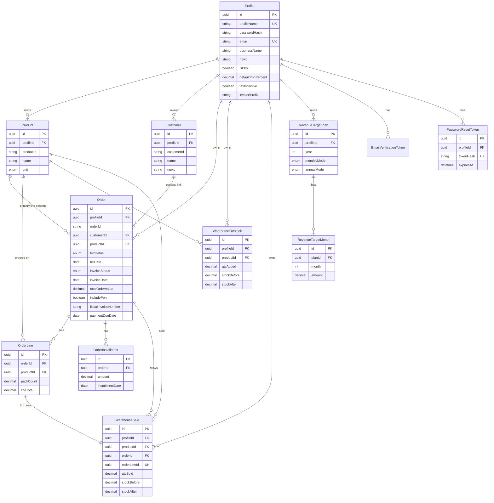
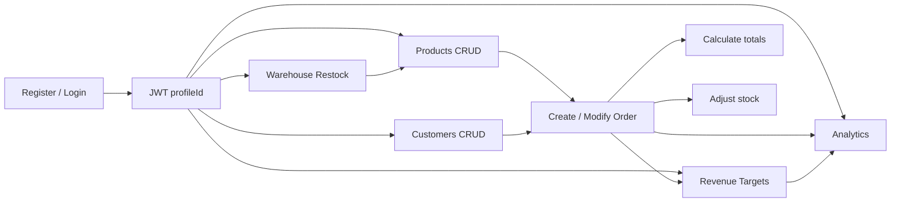

# Variables Catalog — UMKM Hub

| Field | Value |
|-------|-------|
| **Product** | UMKM Hub |
| **Version** | 1.5.277 |
| **Date** | 2026-08-06 |
| **Purpose** | Canonical definitions for domain variables, formulas, app locations, and examples |
| **Code tip aligned** | v1.5.277 |
| **Money precision** | 4 decimal places in API/DB unless noted |

---

## 1. Entity relationship diagram

---

## 2. End-to-end usage flow

---

## 3. Variable relationship chart (formulas)

How key computed values depend on each other in the apps:

```mermaid
flowchart TB
  subgraph Catalog
    packPrice[packPrice / pricePerUnit]
    packCost[packCost / costPerUnit]
    packSize[packSize]
    stockQty[stockQty]
  end

  subgraph OrderLines
    packCount[packCount]
    productQty["productQty = packSize × packCount"]
    lineTotal["lineTotal = packPrice × packCount"]
  end

  subgraph OrderHeader
    sumLines["order.lineTotal = Σ lineTotals"]
    discount[discountType + discountValue]
    total["totalOrderValue"]
    fiscal["amountDue = fiscalBreakdown(total)"]
    paid["paidAmount = Σ installments"]
    remaining["remainingAmount = max(0, amountDue − paid)"]
    bill["billStatus + billDate"]
    invoice["invoiceStatus = derive(paid, amountDue, bill)"]
  end

  subgraph InventoryValue
    potRev["potentialRevenue = stockQty × pricePerUnit"]
    potCost["potentialCost = stockQty × costPerUnit"]
    unitProfit["unitProfit = price − cost"]
    margin["profitMarginPercent"]
  end

  subgraph TargetsAnalytics
    actual["actual = Σ totalOrderValue ≠ CANCELLED"]
    target[monthly / annual target]
    attain["attainmentPercent = actual / target × 100"]
    onPlan["monthsOnPlanRate = months≥100% ÷ months with target"]
    pace["paceRate = YTD actual ÷ elapsed month targets"]
    coverage["monthCoverageRate = months with target ÷ 12"]
    aov["avgOrderValue = revenue / orderCount"]
    basket["avgBasketSize (UPT) = Σ(packCount) / orderCount"]
    apf["avgPurchaseFrequency (APF) = linkedOrders / uniqueCustomers"]
    ltv["avgLtv = linkedRevenue / distinctCustomers"]
    stageMargin["stage margin% = profit / netRevenue × 100"]
    rateBase["gross = revenue + discount"]
    discPct["discountPercent = discount / gross × 100"]
    costPct["costPercent = cost / gross × 100"]
    margPct["table marginPercent = profit / gross × 100"]
  end

  packSize --> productQty
  packCount --> productQty
  packPrice --> lineTotal
  packCount --> lineTotal
  lineTotal --> sumLines
  sumLines --> discount
  discount --> total
  total --> fiscal
  fiscal --> paid
  paid --> remaining
  bill --> invoice
  paid --> invoice
  fiscal --> invoice
  stockQty --> potRev
  packPrice --> potRev
  stockQty --> potCost
  packCost --> potCost
  packPrice --> unitProfit
  packCost --> unitProfit
  unitProfit --> margin
  total --> actual
  actual --> attain
  target --> attain
  attain --> onPlan
  actual --> pace
  target --> pace
  target --> coverage
  actual --> aov
  actual --> basket
  actual --> ltv
  actual --> stageMargin
  total --> rateBase
  rateBase --> discPct
  rateBase --> costPct
  rateBase --> margPct
```

---

## 4. Variable definitions

Professional catalog: **variable name**, **friendly name**, **definition**, **formula / rule**, **location in the apps**, **example**.

### 4.1 Profile & auth

| Variable | Friendly name | Definition | Formula / rule | Location | Example |
|----------|---------------|------------|----------------|----------|---------|
| `id` (Profile) | Profile ID | System-generated tenant key | `uuid()` | DB `Profile.id`; `GET/PATCH/DELETE /profiles/me`; web/mobile Profile | `a1b2c3d4-…` |
| `profileName` | Username | Unique login identifier (UI: Username; immutable after register) | `[A-Za-z0-9._-]{3,64}`, unique | `POST /auth/register`; login; Profile UI (read-only) | `sari_umkm` |
| `login` (auth) | Login identifier | Username or email for sign-in | username as stored, or email (case-insensitive) | `POST /auth/login` body `login` (alias `profileName`) | `sari@example.com` |
| `password` / `passwordHash` | Password / hash | Access credential (bcrypt) | cost **12**; min length 8 | Auth; Profile; **own-profile export** seals hash as `pwd1:…`; **all-profiles export** may emit plaintext `password` (not hash) | `••••••••` / `pwd1:…` |
| `PasswordResetToken.tokenHash` | Reset token digest | HMAC of raw reset token | never store raw token; TTL 24h | DB; `POST /auth/forgot-password`, `reset-password` | `a3f2…` |
| `PASSWORD_RESET_SECRET` | Reset crypto secret | Key for reset HMAC | Falls back to `JWT_ACCESS_SECRET` | `apps/api/.env` | (secret) |
| `DATA_EXPORT_PROFILE_NAMES` | Export allowlist | Usernames allowed to dump all profiles | Comma-separated; default `rifqi_tjahyono` | `.env`; export/import | `rifqi_tjahyono` |
| `SANDBOX_EXPORT_PASSWORDS` | Sandbox password map | Plaintext passwords for privileged export column | `name:pass` pairs | `.env`; privileged export | `rifqi_tjahyono:12041994` |
| `IMPORT_BOOTSTRAP_PASSWORD` | Import bootstrap password | Password for new profiles created on privileged import | Used when no password in file | `.env`; import | (secret) |
| `LIST_PAGE_MAX` | List page max | Hard cap on `limit` query | **500000** | `pagination.dto.ts` | `500000` |
| `entity` (export/import) | Feature transfer entity | Scope dump to one domain | `products` \| `customers` \| `orders` \| `warehouse` \| `targets` | `GET /export`, `POST /import` | `orders` |
| `warehouseSales` (export) | Warehouse sold rows | Stock-draw history tied 1:1 to an order line | Unique natural key `orderLineId` | `DataExportBundle`; merge-import | `{ id, orderLineId, qtySold, … }` |
| Order line natural key | Line merge key | Dedupes lines when UUIDs differ across apps | `orderId` + `productId` + `sortOrder` | import dedupe + `mergeOrderLines` | `ord::prod::0` |
| Installment natural key | Installment merge key | Dedupes payments when UUIDs differ | `orderId` + `installmentDate` + `amount` | import dedupe + `mergeInstallments` | `ord::2026-01-01::100` |
| Restock natural key | Restock merge key | Fingerprint of a stock-in event | profileId+productId+date+qty+before+after | import dedupe + `mergeRestocks` | `p::prod::date::…` |
| `firstName` | First name | Optional given name | 1–64 when set | `PATCH /profiles/me`; Profile UI | `Sari` |
| `lastName` | Last name | Optional family name | 1–64 when set | `PATCH /profiles/me`; Profile UI | `Wijaya` |
| `email` | Email | Required unique identity email (1:1 with username; immutable after register) | RFC email; unique; NOT NULL; stored lowercased | `POST /auth/register`; login; Profile UI (read-only) | `sari@example.com` |
| `emailVerifiedAt` | Email verified at | When email link was confirmed | timestamp or null | Profile; set by verify-email | `2026-07-26T…` |
| `accountVerifiedAt` | Account verified at | When account was verified (with email in v1) | timestamp or null | Profile; set by verify-email | `2026-07-26T…` |
| `EmailVerificationToken.tokenHash` | Verify token digest | HMAC of raw email-verify token | never store raw token | DB only | `a3f2…` |
| `RESEND_API_KEY` | Resend API key | Outbound email provider | optional; without it, links are logged/dev-returned | `apps/api/.env` | (secret) |
| `APP_PUBLIC_URL` | Public web URL | Base for verify links | no trailing slash | `apps/api/.env` | `http://localhost:3000` |
| `locationCity` | City (sealed) | AES-256-GCM blob of city (`loc1:…`) | seal/open with location key | DB sealed; API returns decrypted to owner | `loc1:…` / `Jakarta` |
| `locationCountry` | Country (sealed) | AES-256-GCM blob of country | same | DB sealed; API returns decrypted to owner | `loc1:…` / `Indonesia` |
| `locationIpHash` | IP digest | HMAC-SHA256 of client IP when source is IP | `h1:<hex>`; cleared on manual/clear | DB only; never returned by API | `h1:0e44…` |
| `locationSet` | Location on file | Whether sealed city/country exist | `has(city) OR has(country)` | API `GET /profiles/me` | `true` |
| `locationNeedsReentry` | Re-enter location | Legacy irreversible HMAC city/country | true when only `h1:` blobs remain | API `GET /profiles/me` | `false` |
| `locationSource` | Location source | How location was set | `MANUAL` \| `IP` \| null | Profile; set by detect or edit | `IP` |
| `PROFILE_LOCATION_SECRET` | Location crypto secret | Key material for seal + IP HMAC | Falls back to `JWT_ACCESS_SECRET` | `apps/api/.env` | (secret) |
| `businessName` | Business name | Seller legal/trade name on invoices | free text | Profile invoicing | `CV Melati Sejahtera` |
| `businessPhone` / `businessAddress` | Business contact | Seller phone/address on PDF | free text | Profile invoicing | `0812…` / `Jl. …` |
| `Profile.npwp` | Seller NPWP | Tax ID for PDF / e-Faktur prep | digits; `formatNpwp` for display | Profile invoicing | `10.0.0.2-123.000` |
| `isPkp` | PKP flag | Seller is Pengusaha Kena Pajak | boolean; drives default PPN | Profile | `true` |
| `defaultPpnPercent` | Default PPN % | Profile PPN rate | default **11** | Profile | `11` |
| `taxInclusive` | Tax inclusive prices | Order totals already include PPN | boolean | Profile | `false` |
| `invoicePrefix` | Invoice prefix | Prefix for fiscalInvoiceNumber | 2–12 alnum | Profile | `INV` |
| `DATA_EXPORT_PROFILE_NAMES` | Cross-tenant export/import allowlist | Comma-separated `profileName` values that may dump or merge **all** profiles via `GET /export` / `POST /import`; every authenticated user may still export/import their **own** profile | Default `rifqi_tjahyono` when unset/empty | `apps/api/.env` | `rifqi_tjahyono` |
| `IMPORT_BOOTSTRAP_PASSWORD` | Import bootstrap password | Plain password hashed for **new** profiles created during cross-tenant import (existing profiles keep their password) | Default `umkm-import-change-me` when unset | `apps/api/.env` | (secret) |
| JWT `sub` | Token subject | Authenticated profile id | Payload `{ sub, profileName }` | Access & refresh tokens | same as Profile id |
| `DATABASE_URL` | Database URL | Postgres connection string | Prisma datasource | `apps/api/.env` | `postgresql://umkm:…@localhost:5432/umkm_hub` |
| Sandbox `profileName` | Sandbox login | Seeded demo account | Create-if-missing in seed | `apps/api/prisma/seed.ts` | `rifqi_tjahyono` |
| Sandbox password | Sandbox password | Initial password for seed profile | Set only on first create | Seed / CONTRIBUTING | `12041994` |

### 4.2 Product catalog & pricing

| Variable | Friendly name | Definition | Formula / rule | Location | Example |
|----------|---------------|------------|----------------|----------|---------|
| `Product.productId` | Product code | Human + system product code | `{INITIALS}_{PACK}_{uuid}` | Product API/UI; unique per profile | `CB_100_00000000-…` |
| `name` | Product name | Catalog display name | Required string | Products | `Cabai Merah` |
| `unit` | Product unit | Stock/sell unit | `PCS` \| `GRAM` \| `LITER` | Products | `GRAM` |
| `price1`…`price1000` | Pack sell prices | Selling price for fixed pack sizes | Optional decimals; sizes **1, 5, 10, 25, 50, 100, 250, 500, 1000**; exactly one pack active for gram/liter | Product; `packages/shared` `GRAM_LITER_PACK_SIZES` | `20000` for 100g |
| `priceCustom` / `customSize` | Custom pack | Custom size + sell price | Optional pair | Product | size `75`, price `9000` |
| `cost1`…`cost1000` | Pack costs | Purchase/COGS for fixed packs | Optional; same size slots as prices | Product | `3000` for 100g |
| `costCustom` | Custom pack cost | COGS for `customSize` | Optional; shares size | Product | `4500` |
| `pricePerUnit` | Unit sell price | Price per 1 stock unit | PCS = entered; else `packPrice / packSize` | Product / Orders base | `200` |
| `costPerUnit` | Unit cost | COGS per 1 stock unit | PCS = entered; else `packCost / packSize`; nullable | Product | `30` |
| `stockQty` | On-hand stock | Current inventory in stock units | Starts 0; +restock; −orders | Product / Warehouse | `1500` |
| `unitProfit` | Unit profit | Gross margin per stock unit | `pricePerUnit − costPerUnit` or null | Product API; Products; Warehouse | `20` |
| `profitMarginPercent` | Profit margin % | Margin vs sell price | `(price − cost) / price × 100` or null | Product API; Products; Warehouse | `40` |
| `potentialRevenue` | Potential revenue | Inventory sell value | `stockQty × pricePerUnit` | Product API / Warehouse | `24000` |
| `potentialCost` | Potential cost | Inventory COGS value | `stockQty × costPerUnit` or null | Product API / Warehouse | `15000` |
| `potentialProfit` | Potential profit | Inventory gross profit | `stockQty × unitProfit` or null | Product API / Warehouse | `9000` |
| `packsOnHand` | Packs on hand | How many catalog packs in stock | `stockQty / packSize` | Warehouse UI | `15` |
| `details` | Product details | Free-text notes | max 5000; View only in list UX | Product | `Halal certified` |
| `products.stockSales.currentStocks` | Current stocks | On-hand stock units | `GREATEST(stockQty, 0)` | `GET /products/stock-sales` | `1500` |
| `products.stockSales.soldStocks` | Sold stocks | Units sold on non-cancelled orders | `Σ OrderLine.productQty` | `GET /products/stock-sales` | `4200` |
| `products.stockSales.totalStocks` | Stocks (total) | Current + sold; UI primary Stocks figure | `currentStocks + soldStocks` | `GET /products/stock-sales`; Stock & sales table | `5700` |
| `products.stockSales.grossRevenue` | Product gross revenue | Pre-discount allocated sales (UI Revenue primary / Gross) | `revenue + discount` | `GET /products/stock-sales` | `2340000` |
| `products.stockSales.revenue` | Product net revenue | Discount-allocated net line revenue (UI Revenue subline **Net**) | `Σ lineTotal × order.totalOrderValue / order.lineTotal` | `GET /products/stock-sales` | `2220000` |
| `products.stockSales.discount` | Product discount | Allocated order discount on product lines | `Σ lineTotal × (order.lineTotal − order.totalOrderValue) / order.lineTotal` | `GET /products/stock-sales` | `120000` |
| `products.stockSales.discountPercent` | Discount % | Discount share of gross | `discount ÷ grossRevenue × 100` | `GET /products/stock-sales` | `5.1` |
| `products.stockSales.cost` | Product COGS | Estimated cost of units sold | `soldStocks × costPerUnit` (null if cost unset) | `GET /products/stock-sales` | `900000` |
| `products.stockSales.costPercent` | Cost % | COGS share of gross | `cost ÷ (revenue + discount) × 100` (null if cost unset or gross 0) | `GET /products/stock-sales` | `38.5` |
| `products.stockSales.profit` | Product profit | Net after COGS | `revenue − cost` (null if cost unset) | `GET /products/stock-sales` | `1320000` |
| `products.stockSales.marginPercent` | Margin % | Profit share of gross | `profit ÷ (revenue + discount) × 100` (null if cost unset or gross 0) | `GET /products/stock-sales` | `56.4` |
| `products.stockSales.sellThroughRate` | STR | Sell-through rate | `sold ÷ (sold + current) × 100` | `GET /products/stock-sales` | `73.68` |
| `products.stockSales.inventoryTurnover` | ITR | Inventory turnover (qty) | `sold ÷ ((beginning + ending) ÷ 2)` where beginning ≈ current + sold, ending = current | `GET /products/stock-sales` | `1.2` |
| `products.stockSales.stockToSalesRatio` | SSR | Stock-to-sales ratio (qty) | `current ÷ sold` | `GET /products/stock-sales` | `0.36` |
| `products.stockSales.orderCount` | Product orders | Distinct non-cancelled orders with the SKU | `COUNT DISTINCT Order.id` | `GET /products/stock-sales` | `12` |
| `products.stockSales.avgOrderValue` | Product AOV | Mean allocated net revenue per order | `Σ (lineTotal × order.totalOrderValue / order.lineTotal) ÷ orderCount` | `GET /products/stock-sales` | `185000` |
| `products.stockSales.unitsPerTransaction` | Product UPT | Mean packs per order | `Σ packCount ÷ orderCount` | `GET /products/stock-sales` | `2.5` |

### 4.3 Customers (CRM)

| Variable | Friendly name | Definition | Formula / rule | Location | Example |
|----------|---------------|------------|----------------|----------|---------|
| `Customer.customerId` | Customer code | Name + company type + system id | `{NameSegs}{R\|H\|S}_{uuid}` | Customer; unique per profile | `BuSaR_00000000-…` |
| `Customer.npwp` | Buyer NPWP | Customer tax ID for invoices | optional free text / digits | Customer; PDF / fiscal | `01.234…` |
| `name` / `title` / `companyName` | Identity | Person + company | Required | Customers | `Budi Santoso`, `Owner`, `Warung Melati` |
| `companyType` | Company type | Customer segment | `RESTAURANT` \| `HOTEL` \| `STORE` | Customer | `HOTEL` |
| `email` / `phone` | Contacts | Optional contact fields | Free text | Customer | `budi@…` |
| `address` | Address | Street / line 1 | ≤500; may auto-fill from postal | Customer | `Jl. Melati No. 12` |
| `additionalAddress` | Additional address | Line 2 | ≤500 | Customer | `RT 03/RW 05` |
| `postalCode` | Postal code | ZIP / kode pos | ≤32; with country triggers geo | Customer | `40123` |
| `city` / `province` / `country` | Locality | Geographic fields | ≤120; geo may fill city/province | Customer | `Bandung`, `Jawa Barat`, `Indonesia` |
| `partnershipStage` | Partnership stage | Outreach channel | `WHATSAPP` \| `EMAIL` \| `DIRECT_VISIT` | Customer | `WHATSAPP` |
| `status` | Customer status | Interest level | `NOT_INTERESTED` \| `DOUBTFUL` \| `INTERESTED` \| `OTHERS` | Customer | `INTERESTED` |
| `customerNeeds` / `desiredStandards` | Needs & standards | Free-text CRM notes | Optional | Customer | `Need weekly delivery` |
| `promiseAnnualBonus` | Promise: annual bonus | Commercial promise flag | boolean | Customer | `true` |
| `promiseOnTimeDelivery` | Promise: on-time delivery | Commercial promise flag | boolean | Customer | `true` |
| `promisePackagingBox` | Promise: packaging box | Commercial promise flag | boolean | Customer | `false` |
| `relationshipLevel` | Relationship level | Sales stage | `NEGOTIATION` \| `REQUEST_SAMPLE` \| `CLOSING_FIRST_ORDER` \| `WILL_CONTACT` \| `INITIAL_APPROACH` | Customer | `REQUEST_SAMPLE` |
| `approvalPercentage` | Approval % | Deal confidence | integer 0–100 | Customer | `70` |
| `remarks` | Remarks | Free notes | Optional | Customer | `Call Monday` |
| `customers.orderTotals.totals` | Customer gross revenue | Pre-discount sum of linked orders (UI primary **Revenue** / Gross) | `Σ Order.lineTotal` (status ≠ CANCELLED, linked) | `GET /customers/order-totals`; Customers Order totals | `2000000` |
| `customers.orderTotals.grossRevenue` | Customer gross (alias) | Same value as totals | `= totals` | `GET /customers/order-totals` | `2000000` |
| `customers.orderTotals.discount` | Customer discount | Absolute discount off linked orders | `Σ (lineTotal − totalOrderValue)` | `GET /customers/order-totals` | `120000` |
| `customers.orderTotals.orderTotal` | Customer net revenue | Post-discount commercial sum (UI Revenue subline **Net**) | `Σ Order.totalOrderValue` | `GET /customers/order-totals` | `1880000` |
| `customers.orderTotals.discountPercent` | Customer discount % | Discount share of totals | `discount ÷ totals × 100` or null | Serialized on order-totals | `6` |
| `customers.orderTotals.orderCount` | Customer order count | Linked non-cancelled orders | `COUNT(Order)` where status ≠ CANCELLED | `GET /customers/order-totals` | `8` |
| `customers.orderTotals.packsSold` | Customer packs | Packs on non-cancelled linked orders | `Σ OrderLine.packCount` | `GET /customers/order-totals` | `24` |
| `customers.orderTotals.cancelledCount` | Cancelled orders | Linked cancelled orders | `COUNT` where status = CANCELLED | `GET /customers/order-totals` | `1` |
| `customers.orderTotals.cancelRate` | Cancel rate | Share of linked orders cancelled | `cancelled ÷ (active + cancelled) × 100` | `GET /customers/order-totals` | `11.11` |
| `customers.orderTotals.avgOrderValue` | Customer AOV | Mean post-discount order value | `orderTotal ÷ orderCount` | `GET /customers/order-totals` | `235000` |
| `customers.orderTotals.unitsPerTransaction` | Customer UPT | Mean packs per active order | `packsSold ÷ orderCount` | `GET /customers/order-totals` | `3` |

### 4.4 Orders, lines & payments

| Variable | Friendly name | Definition | Formula / rule | Location | Example |
|----------|---------------|------------|----------------|----------|---------|
| `Order.orderId` | Order code | Date-based human id | `YYYY_MM_DD_{uuid}` | Order; unique per profile | `2026_07_25_00000000-…` |
| `Order.customerId` | Order customer FK | Optional CRM link (UUID) | FK → `Customer.id`; nullable; SetNull on delete | Order; Analytics LTV | uuid |
| `Order.productId` | Primary product FK | Denormalized first-line product UUID | FK → `Product.id` | Order list/legacy | uuid |
| `orderDate` | Order date | Business date of the order | Defaults to today; drives Order.orderId | Order | `2026-07-25` |
| `shipmentDate` | Shipment date | Planned/actual ship date | Optional | Order View Timeline | `2026-07-26` |
| `status` | Order status | Fulfillment lifecycle | `PENDING` \| `CONFIRMED` \| `SHIPPED` \| `DELIVERED` \| `CANCELLED` | Order | `PENDING` |
| `paymentStatus` | Payment terms | Commercial payment mode | `CASH` \| `CONSIGNMENT` \| `DELAYED_PAYMENT` \| `KONTRA_BON` | Order | `CASH` |
| `billStatus` | Bill status | Bill document state | `CREATED` \| `SENT` | Order | `SENT` |
| `billDate` | Bill date | Bill business date | Optional; defaults to order date on create | Order | `2026-07-25` |
| `invoiceStatus` | Invoice collection status | Collection state (often derived) | `CREATED` \| `SENT` \| `PARTIALLY_PAID` \| `FULLY_PAID` | Order | `PARTIALLY_PAID` |
| `invoiceDate` | Invoice date | Invoice business date | Optional; defaults to order date on create | Order | `2026-07-25` |
| `orderDateFrom` / `orderDateTo` | Order date filter | Inclusive list/summary range on `orderDate` | YYYY-MM-DD; omit = no bound; inverted from/to swapped | `GET /orders`, `GET /orders/summary`, Dashboard Period | `2024-01-01` |
| `paymentStatus` (filter) | Payment status filter | Restrict list/summary to selected payment terms | Comma-separated `CASH` / `CONSIGNMENT` / `DELAYED_PAYMENT` / `KONTRA_BON` | `GET /orders`, `GET /orders/summary` | `CASH,CONSIGNMENT` |
| `shipmentDateFrom` / `shipmentDateTo` | Shipment date filter | Inclusive list range on `shipmentDate` | Same; excludes null shipment dates when set | `GET /orders` | `2024-06-01` |
| `invoiceDateFrom` / `invoiceDateTo` | Invoice date filter | Inclusive list range on `invoiceDate` | Same; excludes null invoice dates when set | `GET /orders` | `2024-06-30` |
| `packSizeSnapshot` | Pack size | Locked pack size on line | From product packs; `1` for PCS | OrderLine | `100` |
| `packPriceSnapshot` | Pack price | Locked selling price per pack | Snapshot at order time | OrderLine | `20000` |
| `packCount` | Pack count | Number of packs / pieces | > 0 | OrderLine | `2` |
| `productQty` | Stock qty ordered | Quantity in stock units | `packSize × packCount` | OrderLine | `200` |
| `unitPriceSnapshot` | Unit price at order | Rate per stock unit | `packPrice / packSize` | OrderLine | `200` |
| `lineTotal` (line) | Line subtotal | Pre-discount line value | `packPrice × packCount` (= unitPrice × productQty) | OrderLine | `40000` |
| `lineTotal` (order) | Pre-discount order total | Sum of line totals | `SUM(OrderLine.lineTotal)` | Order | `150000` |
| `discountType` | Discount type | How discount applies | `PERCENTAGE` \| `AMOUNT` | Order | `PERCENTAGE` |
| `discountValue` | Discount value | % or amount | % ≤ 100; amount ≤ order lineTotal | Order | `10` |
| `totalOrderValue` | Total order value | After order-level discount (pre-PPN commercial total) | %: `line×(1−d/100)`; amount: `line−d` | Order | `135000` |
| `includePpn` | Include PPN | Order override for PKP tax | `null` → use profile `isPkp`; else boolean | Order | `null` |
| `amountDue` | Amount due | Invoice total after fiscal breakdown (**computed read DTO**, not a Prisma column) | `computeFiscalBreakdown(totalOrderValue, …).total` via `resolveOrderAmountDue` | Order read DTO; installments; Paid % | `149850` |
| `computeFiscalBreakdown` | Fiscal DPP/PPN/total | Tax breakdown for PDF/e-Faktur | Non-PKP: DPP=total, PPN=0. Inclusive: DPP=total/(1+r), PPN=total−DPP. Exclusive: DPP=total, PPN=DPP×r, total=DPP+PPN | `fiscal-invoice.ts` | `{ dpp:135000, ppn:14850, total:149850 }` |
| `fiscalInvoiceNumber` | Fiscal invoice number | Human invoice # on PDF | `PREFIX-YYYYMMDD-XXXXXXXX`; auto on PDF if empty | Order | `INV-20260731-A1B2C3D4` |
| `paymentDueDate` | Payment due date | When delayed payment / kontra bon is due | Optional date; UX-required for `DELAYED_PAYMENT` and `KONTRA_BON` | Order | `2026-08-15` |
| `allocateLineRevenue` | Allocated line revenue | Line share of post-discount total | Proportional to lineTotal; last line absorbs drift | `order-math.ts`; Analytics | — |
| `installment.amount` | Installment amount | Payment recorded | ≥ 0; sum ≤ **amountDue** | OrderInstallment | `54000` |
| `installmentDate` | Installment date | Payment date | Non-decreasing in list order | OrderInstallment | `2026-08-01` |
| `paidAmount` | Paid amount | Sum of installments | `SUM(installment.amount)` | Order read DTO | `54000` |
| `remainingAmount` | Remaining amount | Unpaid balance vs amount due | `max(0, amountDue − paidAmount)` | Order read DTO | `95850` |
| `order.paymentRate` | Order paid % | Progress of installments vs amount due | `paidAmount ÷ amountDue × 100` | Orders list Paid column | `100` |
| `deriveInvoiceStatusFromPayments` | Derived invoice status | From paid vs **amountDue** + bill | unpaid → mirror bill; partial → `PARTIALLY_PAID`; paid ≥ amountDue → `FULLY_PAID` | `order-installments.ts`; OrdersService | `FULLY_PAID` |
| `orders.summary.cancellationRate` | Cancellation rate | Share of orders cancelled | `cancelledCount ÷ allOrders × 100` (null if none) | `GET /orders/summary` | `2.5` |
| `orders.summary.profitMarginRate` | Profit margin rate | Margin on post-discount revenue | `(revenue − COGS) ÷ revenue × 100` when any catalog cost exists | `GET /orders/summary` | `58.2` |
| `orders.summary.discountRate` | Discount rate | Discount share of pre-discount totals | `(Σ lineTotal − Σ total) ÷ Σ lineTotal × 100` | `GET /orders/summary` | `6.4` |
| `orders.summary.fullPaymentRate` | Full-payment rate | Share of active orders paid in full | `count(paid ≥ amountDue − ε) ÷ activeOrders × 100` (CANCELLED excluded) | `GET /orders/summary` | `25` |
| `products.summary.inventorySellValue` | Inventory sell value | Stock × unit price across catalog | `Σ(stockQty × pricePerUnit)` | `GET /products/summary` | `125000` |
| `products.summary.outOfStockRate` | Out-of-stock rate | Zero-stock SKU share | `count(stock≤0) ÷ products × 100` | `GET /products/summary` | `12.5` |
| `products.summary.packReadyRate` | Pack-ready rate | PCS or SKUs with a pack price | `packReady ÷ products × 100` | `GET /products/summary` | `90` |
| `warehouse.summary.inventorySellValue` | Warehouse sell value | Same inventory sell math | `Σ(stockQty × pricePerUnit)` | `GET /warehouse/summary` | `125000` |
| `warehouse.summary.profitMarginRate` | Warehouse margin | Margin on costed inventory | `(sell − cost) ÷ sell × 100` when cost known | `GET /warehouse/summary` | `58` |
| `customers.summary.avgApproval` | Avg approval | Mean approval % | `Σ approval ÷ customers` | `GET /customers/summary` | `70` |
| `customers.summary.interestedRate` | Interested rate | Status = INTERESTED share | `interested ÷ customers × 100` | `GET /customers/summary` | `40` |
| `customers.summary.closingRate` | Closing rate | Relationship = CLOSING_FIRST_ORDER | `closing ÷ customers × 100` | `GET /customers/summary` | `20` |
| `customers.summary.contactRate` | Contact rate | Email or phone on file | `withContact ÷ customers × 100` | `GET /customers/summary` | `80` |

### 4.5 Warehouse

| Variable | Friendly name | Definition | Formula / rule | Location | Example |
|----------|---------------|------------|----------------|----------|---------|
| `qtyAdded` | Restock qty | Stock units added | > 0; Manual or packs × pack size | WarehouseRestock | `500` |
| `restockDate` | Restock date | Business date of incoming stock | Defaults to today | WarehouseRestock | `2026-07-24` |
| `notes` | Restock notes | Optional free text | — | WarehouseRestock | `Supplier batch A` |
| `stockBefore` / `stockAfter` | Stock snapshots | Inventory before/after restock | `after = before + qtyAdded` | WarehouseRestock | `1000` / `1500` |
| `qtySold` | Sold qty | Stock units drawn by an order line | `= OrderLine.productQty`; progressive per line | WarehouseSale | `2.5` |
| `soldDate` | Sold date | Business date of the stock draw | Copied from `Order.orderDate` | WarehouseSale | `2026-08-01` |
| `orderLineId` | Sale line key | Unique link to the order line that drew stock | 1:1 with OrderLine | WarehouseSale | uuid |
| `orderRef` | Order reference | Human order code for UI | `order.orderId` (serialized) | `GET /warehouse/sales` | `ORD-99` |
| `sale.stockBefore` / `sale.stockAfter` | Sale stock snapshots | On-hand immediately before/after the draw | `after = max(0, before − qtySold)` | WarehouseSale | `10` / `7.5` |
| `packSizeSnapshot` / `packCount` | Pack snapshots | Pack size/count at sale time | Copied from OrderLine | WarehouseSale | `1` / `2.5` |

### 4.6 Revenue targets

| Variable | Friendly name | Definition | Formula / rule | Location | Example |
|----------|---------------|------------|----------------|----------|---------|
| `year` | Target year | Calendar year for the plan | 2000–2100 | RevenueTargetPlan; `/revenue-targets` | `2026` |
| `monthlyMode` | Monthly mode | How monthly targets are set | `MANUAL` \| `SYSTEMATIC` | RevenueTargetPlan | `SYSTEMATIC` |
| `annualMode` | Annual mode | How annual target is set | `MANUAL` \| `SYSTEMATIC` | RevenueTargetPlan | `MANUAL` |
| `baseMonthAmount` | January base | Month-1 target for systematic monthly | ≥ 0 | RevenueTargetPlan | `10000000` |
| `monthlyGrowthPercent` | MoM growth % | Compound growth each month | `amount(m) = base × (1 + g/100)^(m−1)` | RevenueTargetPlan | `5` |
| `annualAmount` | Manual annual target | Year total when annualMode=MANUAL | ≥ 0 | RevenueTargetPlan | `150000000` |
| `baseAnnualAmount` | Systematic annual base | This year’s annual when SYSTEMATIC | ≥ 0 | RevenueTargetPlan | `150000000` |
| `annualGrowthPercent` | YoY growth % | Projects next year’s annual | `next = base × (1 + g/100)` | RevenueTargetPlan | `20` |
| `month` / `amount` | Monthly target | Target revenue for month 1–12 | Stored per plan; annual save → even split (Dec remainder) | RevenueTargetMonth | month `3`, `11025000` |
| `source` | Month source | How month amount was produced | `MANUAL` \| `GENERATED` | RevenueTargetMonth | `GENERATED` |
| `actual` | Actual revenue | Sum of order totals in period | `SUM(totalOrderValue)` where status ≠ `CANCELLED` | `/revenue-targets/:year`; Analytics | `8500000` |
| `attainmentPercent` | % of target / Attainment | Share of revenue target reached | `(actual / target) × 100` or null if target ≤ 0 | Targets API/UI; Analytics; FeatureStage | `85` |
| `monthsOnPlanRate` | On plan rate | Share of targeted months that hit ≥ 100% attainment | `count(attainment ≥ 100) ÷ count(target > 0) × 100` | Web `feature-stage-metrics.ts`; Targets FeatureStage | `66.67` |
| `paceRate` (targets) | Pace rate | YTD actual vs sum of targets for elapsed months | `ytdActual ÷ pacedTarget × 100`; elapsed = UTC months 1…current (past years = 12; future = 0) | Targets FeatureStage | `92.5` |
| `monthCoverageRate` | Coverage rate | Share of year months with a target amount | `count(target > 0) ÷ 12 × 100` | Targets FeatureStage | `100` |
| `nextYearProjected` | Next year projection | Systematic YoY projection from this year’s annual | `base × (1 + annualGrowthPercent/100)` when set | Revenue targets API/UI | `180000000` |
| `analytics.weekly[].target` | Weekly target | Day-weighted share of monthly plan for the ISO week | `Σ_m T_m × (UTC days of week in m) / days(m)`; null if no 12-month plan | `GET /analytics` weekly series | `70000` |

### 4.7 Analytics query contract & summary

| Variable | Friendly name | Definition | Formula / rule | Location | Example |
|----------|---------------|------------|----------------|----------|---------|
| `years` / `year` | Timeline query | Analytics year scope | omit → current UTC year; `all`; `2024,2025` (comma/`+`/space); parse accepts 2000–2100 | `GET /analytics`; `analytics-period.ts` | `2024,2025` |
| `include` | Progressive include | Which overview parts to compute | `summary` \| `series` \| `products` \| `customers` (comma); omit → all | `analytics-query.ts` | `summary,series` |
| `granularity` | Series granularity | Which series to build | `weekly` \| `monthly` \| `quarterly` \| `annual` \| `all`; omit → `all` | `analytics-query.ts` | `monthly` |
| `scope` | Scope label | How the response was scoped | `year` \| `years` \| `all` | Overview response | `year` |
| `ANNUAL_WINDOW` | Annual rolling window | Years loaded for single-year Annual series context | **10** years ending at focus year | `analytics-period.ts` | `10` |
| `APP_YEAR_MIN` / `APP_YEAR_MAX` | App year picker range | Inclusive UI / All-timelines load range | **2020–2035** | `analytics-period.ts`; year pickers | `2020`, `2035` |
| `ANALYTICS_WINDOW_CACHE_TTL_MS` | Analytics window cache TTL | In-process cache for order window loads | **45000** ms; max 64 entries | `analytics-cache.ts` | `45000` |
| `summary.revenue` | Scope revenue | Non-cancelled totals in focus years | Same actuals rules | `GET /analytics` summary | `48000000` |
| `summary.orderCount` | Scope order count | Non-cancelled orders in focus | — | summary | `120` |
| `summary.target` | Scope target | Plan target for focus (month sum / annual) | null when All or no plan | summary | `150000000` |
| `summary.attainmentPercent` | Scope attainment | `actual / target × 100` | null if target ≤ 0 | summary | `72` |
| `summary.monthlyTargetSum` | Monthly target sum | Sum of 12 monthly plan amounts | Used when aligning annual display | summary | `150000000` |
| `summary.cost` / `summary.profit` | Scope cost / profit | Estimated COGS and profit for scope | From margin series on non-cancelled | summary | `20000000` / `28000000` |
| `summary.marginPercent` | Stage margin % | Profit ÷ **net** revenue × 100 | `(profit / revenue) × 100` | summary / charts | `58.3` |
| `summary.avgBasketSize` | UPT | Mean packs per order | `Σ packCount / orderCount` | summary + lens | `2.5` |
| `summary.avgPurchaseFrequency` | APF | Mean orders per linked customer | `linkedOrders / uniqueCustomers` | summary + lens | `1.5` |
| `summary.purchaseFrequencyCustomerCount` | APF denominator | Distinct linked customers in scope | count | summary | `40` |
| `summary.avgProductRevenue` | Avg product revenue | Mean net revenue per product with sales | `productRevenue / distinctProducts` | summary | `2100000` |
| `summary.productSaleCount` | Products with sales | Distinct products sold | count | summary | `8` |
| `summary.avgLtv` / `ltvCustomerCount` | Avg LTV / buyers | Linked revenue ÷ distinct customers | Requires `customerId` | summary | `3750000` / `12` |
| `summary.avgShipmentDays` (+ sample) | Ship lead time | Mean order→shipment days | sample size paired | summary | `5` / `90` |
| `summary.avgInvoiceDays` (+ sample) | Invoice lead time | Mean order→invoice days | sample with `invoiceDate` | summary | `2` / `80` |
| `summary.avgFirstPaymentDays` / `avgPaymentDays` | Payment lead times | First / last installment means | sample sizes paired | summary | `7` / `30` |

### 4.8 Analytics series & tables

| Variable | Friendly name | Definition | Formula / rule | Location | Example |
|----------|---------------|------------|----------------|----------|---------|
| `analytics.monthly[].revenue` | Month revenue | Non-cancelled order totals in month | UTC month of `orderDate` | `GET /analytics` | `2250000` |
| `analytics.monthly[].orderCount` | Month order count | Count of non-cancelled orders | — | `GET /analytics` | `12` |
| `analytics.quarterly[].revenue` | Quarter revenue | Non-cancelled order totals in UTC quarter | Q1=Jan–Mar … Q4=Oct–Dec | `GET /analytics` | `6750000` |
| `analytics.quarterly[].orderCount` | Quarter order count | Count of non-cancelled orders in quarter | — | `GET /analytics` | `36` |
| `analytics.quarterly[].target` | Quarter target | Sum of monthly plan amounts in the quarter | `T_q = T_m1 + T_m2 + T_m3`; null if no 12-month plan | `GET /analytics` quarterly series | `9000000` |
| `avgOrderValue` | Average order value | Mean ticket size | `revenue / orderCount` (null if none) | Summary / series | `2500000` |
| `avgBasketSize` | Units Per Transaction (UPT) | Mean packs sold per order | `Σ(packCount) / orderCount` (null if none) | Summary / series + Performance chart | `2.5` |
| `avgPurchaseFrequency` | Average purchase frequency (APF) | Mean orders per unique linked customer | `linkedOrders / uniqueCustomers` (null if none) | Summary / series + Performance chart | `1.5` |
| `analytics.annual[].revenue` | Year revenue | Sum for calendar year | Same rules as Targets actuals | `GET /analytics` | `48000000` |
| `avgShipmentDays` | Shipment duration | Avg days order → shipment | Mean UTC day diff; sample = paired rows | Analytics | `5` |
| `avgInvoiceDays` | Invoice duration | Avg days order → invoice | Mean UTC day diff; sample = orders with `invoiceDate` | Analytics lead times | `2` |
| `statusShares` | Order status mix % | % of orders in each `OrderStatus` for the period | `(count(status) / statusOrderCount) × 100`; **includes CANCELLED** | weekly/monthly/quarterly/annual points | `{ DELIVERED: 70, CANCELLED: 10, … }` |
| `statusOrderCount` | Status mix denominator | Orders in period including cancelled | Count of mix-loaded orders | Mix charts | `40` |
| `paymentShares` | Payment mode mix % | % of non-cancelled orders by `PaymentStatus` | `(count(payment) / paymentOrderCount) × 100`; cancelled excluded | series points | `{ CASH: 50, … }` |
| `paymentOrderCount` | Payment mix denominator | Non-cancelled orders in period | Count where status ≠ CANCELLED | Mix charts | `36` |
| `growthLabels` (client) | Period growth in tooltips | Vs prior chart period | Levels: `%`; rates already in %: `bps = Δpp × 100` | Analytics chart tooltips | `+12.5%`, `+200 bps` |
| `avgFirstPaymentDays` | First payment duration | Avg days order → first installment | Mean UTC day diff | Analytics | `7` |
| `avgPaymentDays` | Last payment duration | Avg days order → last installment | Mean UTC day diff | Analytics | `30` |
| `analytics.products[].packsSold` | Product packs sold | Sum of line `packCount` for the product | Non-cancelled, selected scope | `GET /analytics` | `48` |
| `analytics.products[].orderCount` | Product order count | Distinct orders that include the product | Non-cancelled, selected scope | `GET /analytics` | `12` |
| `analytics.products[].firstRepeatOrderDays` | Product 1st repeat | UTC days from first → second order with the product | Sorted order dates; gap[0]; null if fewer than 2 orders | `GET /analytics` | `10` |
| `analytics.products[].avgRepeatOrderDays` | Product avg repeat | Mean UTC days between consecutive orders with the product | Average consecutive gaps; null if fewer than 2 orders | `GET /analytics` | `14.5` |
| `analytics.customers[].firstRepeatOrderDays` | Customer 1st repeat | UTC days from first → second customer order | Same first-gap rule as products | `GET /analytics` | `15` |
| `analytics.customers[].avgRepeatOrderDays` | Customer avg repeat | Mean UTC days between consecutive customer orders | Same gap rule as products | `GET /analytics` | `21` |
| `analytics.products[].grossRevenue` | Product year gross | Pre-discount allocated sales | `revenue + discount` | `GET /analytics` | `2340000` |
| `analytics.products[].revenue` | Product year revenue | Discount-allocated line revenue | Non-cancelled, selected scope | `GET /analytics` | `2250000` |
| `analytics.products[].discount` | Product year discount | Order discount allocated to lines | `gross line − allocated revenue` | `GET /analytics` | `112500` |
| `analytics.products[].discountPercent` | Product discount % | Share of gross given as discount | `(discount / (revenue + discount)) × 100` | `GET /analytics` | `4.0` |
| `analytics.products[].cost` | Est. product COGS | Catalog COGS × qty sold | `costPerUnit × qtySold`; null if unset | `GET /analytics` | `1250000` |
| `analytics.products[].costPercent` | COGS % of gross | Cost share of pre-discount total | `(cost / (revenue + discount)) × 100` | `GET /analytics` | `55.6` |
| `analytics.products[].profit` | Product profit | Revenue − cost | Amount; margin % companion in UI | `GET /analytics` | `900000` |
| `analytics.products[].marginPercent` | Product margin % | Profit share of pre-discount total | `(profit / (revenue + discount)) × 100` | `GET /analytics` | `40.4` |
| `analytics.products[].avgOrderValue` | Product AOV | Net revenue per order with product | `revenue / orderCount` | `GET /analytics` | `187500` |
| `analytics.customers[].packsSold` | Customer packs sold | Sum of line `packCount` across the customer’s orders | Linked orders in scope | `GET /analytics` | `120` |
| `analytics.customers[].orderCount` | Customer order count | Distinct linked orders for the customer | Requires `customerId` | `GET /analytics` | `8` |
| `analytics.customers[].*` | Customer performance | Same metric family for linked orders | Requires `customerId` | `GET /analytics` | — |
| `avgLtv` | Average LTV | Mean linked revenue per active customer | `linkedRevenue / distinctCustomers` | Summary / series | `3750000` |
| `ltvCustomerCount` | LTV buyer count | Distinct customers with ≥1 linked order | count distinct `customerId` | Analytics summary | `12` |
| `avgProductRevenue` | Average product revenue | Mean net revenue per product with sales | `productRevenue / distinctProducts` | Summary / series | `2100000` |
| `productSaleCount` | Products with sales | Distinct products sold in period | count distinct `productId` on lines | Analytics summary | `8` |

### 4.9 Display helpers

| Variable | Friendly name | Definition | Formula / rule | Location | Example |
|----------|---------------|------------|----------------|----------|---------|
| `formatMoney` | Compact money label | Short UI currency display | `≥1e6` million, `≥1e9` billion, `≥1e12` trillion, `≥1e15` quadrillion, `≥1e18` quintillion (2 decimals); else full digits | Web `lib/format-money.ts`; mobile `format_money.dart` | `1.53 million` |
| `formatMoneyExact` | Exact money label | Tooltip / full-precision money | Locale grouping; no magnitude shortcut | Same modules | `1,532,000` |
| `formatCompactAxis` | Chart axis money | Tight money axis ticks | Short Mn/Bn/Tn/Qd/Qn | Web analytics charts | `1.53 Mn` |
| `formatCompactAxisQty` | Chart axis qty | Tight qty axis ticks (keeps decimals &lt; 1e6) | Short Mn/Bn… or full decimals | Basket / frequency charts | `1.5` |
| `paddedDomain` | Chart axis padding | Value-axis min/max headroom | `min − 20%·|min|` … `max + 20%·|max|` (empty/zero → `[0,1]`; optional non-negative floor) | Web `lib/chart-domain.ts`; mobile `chart_domain.dart` | `[8.8, 37.2]` for `[11, 31]` |
| `axisTicks` | Chart tick marks | Even labels across padded domain | 5 evenly spaced points from lo→hi | Web Analytics Y/X value axes | `8.8d … 37.2d` |
| `formatQty` | Quantity label | Full-digit non-currency amounts | Locale grouping; no Mn/Bn | Same modules — stock/qty | `1,532,000` |

---

## 5. Code sources of truth

| Concern | Path |
|---------|------|
| Order math | `apps/api/src/orders/order-math.ts` |
| Invoice / fiscal | `order-installments.ts`, `fiscal-invoice.ts`, `invoice.service.ts`, `invoice-pdf.ts` |
| Stock & sales | `apps/api/src/products/product-stock-sales.ts` |
| Order totals | `apps/api/src/customers/customer-order-totals.ts` |
| Warehouse sales | `apps/api/src/warehouse/` (`WarehouseSale`, `backfill-sales.ts`) |
| Statistics | `*-statistics.ts`, `statistics-buckets.ts` |
| Shared pack sizes | `packages/shared/src/product-packs.ts` (`GRAM_LITER_PACK_SIZES`) |
| Shared totals helper | `packages/shared/src/index.ts` |
| Revenue target math | `apps/api/src/revenue-targets/revenue-target-math.ts` |
| Targets FeatureStage rates | `apps/web/src/lib/feature-stage-metrics.ts` |
| Analytics period / query / cache | `analytics-period.ts`, `analytics-query.ts`, `analytics-cache.ts` |
| Export / import / passwords | `apps/api/src/export/` |
| Password reset | `apps/api/src/auth/` + `password-reset*.ts` |
| Translate | `apps/api/src/translate/` |
| Schema | `apps/api/prisma/schema.prisma` |
| Money formatting | `apps/web/src/lib/format-money.ts`, `apps/mobile/lib/format_money.dart` |

**User-facing glossary:** in-app Dictionary at `/glossary` (web) and Profile → Dictionary (mobile), sourced from `apps/web/src/lib/glossary`. Mobile mirror is generated with `npm run glossary:sync` → `apps/mobile/lib/glossary/glossary_catalog.dart`.

Related: [PRODUCT.md](./PRODUCT.md) · [PRD.md](./PRD.md) · [METRICS.md](./METRICS.md)
