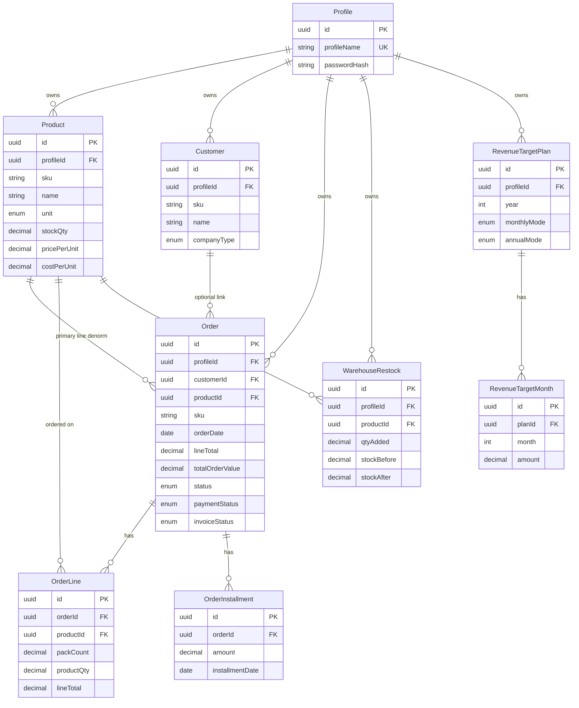
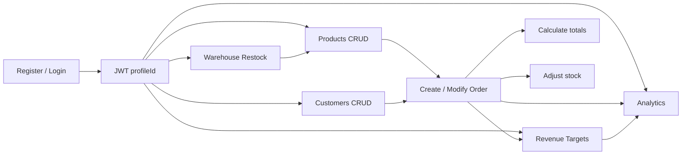
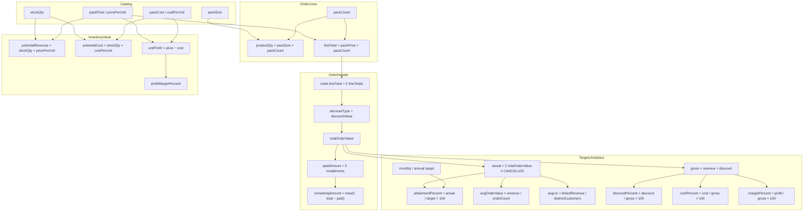

# Variables Catalog — UMKM Hub

| Field | Value |
|-------|-------|
| **Product** | UMKM Hub |
| **Version** | 1.5.88 |
| **Date** | 2026-07-25 |
| **Purpose** | Canonical definitions for domain variables, formulas, app locations, and examples |
| **Money precision** | 4 decimal places in API/DB unless noted |

---

## 1. Entity relationship diagram

---

## 2. End-to-end usage flow

---

## 3. Variable relationship chart (formulas)

How key computed values depend on each other in the apps:

---

## 4. Variable definitions

Professional catalog: **variable name**, **friendly name**, **definition**, **formula / rule**, **location in the apps**, **example**.

### 4.1 Profile & auth

| Variable | Friendly name | Definition | Formula / rule | Location | Example |
|----------|---------------|------------|----------------|----------|---------|
| `id` (Profile) | Profile ID | System-generated tenant key | `uuid()` | DB `Profile.id`; `GET/PATCH/DELETE /profiles/me`; web/mobile Profile | `a1b2c3d4-…` |
| `profileName` | Profile name | Unique login identifier | `[A-Za-z0-9._-]{3,64}`, unique | Auth register/login; Profile | `sari_umkm` |
| `password` / `passwordHash` | Password | Access credential | bcrypt cost **12**; min length 8 | Auth; never returned by API | `••••••••` |
| JWT `sub` | Token subject | Authenticated profile id | Payload `{ sub, profileName }` | Access & refresh tokens | same as Profile id |
| `DATABASE_URL` | Database URL | Postgres connection string | Prisma datasource | `apps/api/.env` | `postgresql://umkm:…@localhost:5432/umkm_hub` |
| Sandbox `profileName` | Sandbox login | Seeded demo account | Create-if-missing in seed | `apps/api/prisma/seed.ts` | `rifqi_tjahyono` |
| Sandbox password | Sandbox password | Initial password for seed profile | Set only on first create | Seed / CONTRIBUTING | `12041994` |

### 4.2 Product catalog & pricing

| Variable | Friendly name | Definition | Formula / rule | Location | Example |
|----------|---------------|------------|----------------|----------|---------|
| `sku` (product) | Product ID | Human + system product code | `{INITIALS}_{PACK}_{uuid}` | Product API/UI | `CB_100_00000000-…` |
| `name` | Product name | Catalog display name | Required string | Products | `Cabai Merah` |
| `unit` | Product unit | Stock/sell unit | `PCS` \| `GRAM` \| `LITER` | Products | `GRAM` |
| `price50`…`price1000` | Pack sell prices | Selling price for fixed pack sizes | Optional decimals; exactly one pack active for gram/liter | Product | `20000` for 100g |
| `priceCustom` / `customSize` | Custom pack | Custom size + sell price | Optional pair | Product | size `75`, price `9000` |
| `cost50`…`cost1000` | Pack costs | Purchase/COGS for fixed packs | Optional | Product | `3000` for 100g |
| `costCustom` | Custom pack cost | COGS for `customSize` | Optional; shares size | Product | `4500` |
| `pricePerUnit` | Unit sell price | Price per 1 stock unit | PCS = entered; else `packPrice / packSize` | Product / Orders base | `200` |
| `costPerUnit` | Unit cost | COGS per 1 stock unit | PCS = entered; else `packCost / packSize`; nullable | Product | `30` |
| `stockQty` | On-hand stock | Current inventory in stock units | Starts 0; +restock; −orders | Product / Warehouse | `1500` |
| `unitProfit` | Unit profit | Gross margin per stock unit | `pricePerUnit − costPerUnit` or null | Product API; Products; Warehouse | `20` |
| `profitMarginPercent` | Profit margin % | Margin vs sell price | `(price − cost) / price × 100` or null | Product API; Products; Warehouse | `40` |
| `potentialRevenue` | Potential revenue | Inventory sell value | `stockQty × pricePerUnit` | Product API / Warehouse | `24000` |
| `potentialCost` | Potential cost | Inventory COGS value | `stockQty × costPerUnit` or null | Product API / Warehouse | `15000` |
| `potentialProfit` | Potential profit | Inventory gross profit | `stockQty × unitProfit` or null | Product API / Warehouse | `9000` |
| `packsOnHand` | Packs on hand | How many catalog packs in stock | `stockQty / packSize` | Warehouse UI | `15` |
| `details` | Product details | Free-text notes | max 5000; View only in list UX | Product | `Halal certified` |

### 4.3 Customers (CRM)

| Variable | Friendly name | Definition | Formula / rule | Location | Example |
|----------|---------------|------------|----------------|----------|---------|
| `sku` (customer) | Customer ID | Name + company type + system id | `{NameSegs}{R\|H\|S}_{uuid}` | Customer | `BuSaR_00000000-…` |
| `name` / `title` / `companyName` | Identity | Person + company | Required | Customers | `Budi Santoso`, `Owner`, `Warung Melati` |
| `companyType` | Company type | Customer segment | `RESTAURANT` \| `HOTEL` \| `STORE` | Customer | `HOTEL` |
| `email` / `phone` | Contacts | Optional contact fields | Free text | Customer | `budi@…` |
| `address` | Address | Street / line 1 | ≤500; may auto-fill from postal | Customer | `Jl. Melati No. 12` |
| `additionalAddress` | Additional address | Line 2 | ≤500 | Customer | `RT 03/RW 05` |
| `postalCode` | Postal code | ZIP / kode pos | ≤32; with country triggers geo | Customer | `40123` |
| `city` / `province` / `country` | Locality | Geographic fields | ≤120; geo may fill city/province | Customer | `Bandung`, `Jawa Barat`, `Indonesia` |
| `partnershipStage` | Partnership stage | Outreach channel | `WHATSAPP` \| `EMAIL` \| `DIRECT_VISIT` | Customer | `WHATSAPP` |
| `status` | Customer status | Interest level | `NOT_INTERESTED` \| `DOUBTFUL` \| `INTERESTED` \| `OTHERS` | Customer | `INTERESTED` |
| `customerNeeds` / `desiredStandards` | Needs & standards | Free-text CRM notes | Optional | Customer | `Need weekly delivery` |
| `promiseAnnualBonus` | Promise: annual bonus | Commercial promise flag | boolean | Customer | `true` |
| `promiseOnTimeDelivery` | Promise: on-time delivery | Commercial promise flag | boolean | Customer | `true` |
| `promisePackagingBox` | Promise: packaging box | Commercial promise flag | boolean | Customer | `false` |
| `relationshipLevel` | Relationship level | Sales stage | `NEGOTIATION` \| `REQUEST_SAMPLE` \| `CLOSING_FIRST_ORDER` \| `WILL_CONTACT` \| `INITIAL_APPROACH` | Customer | `REQUEST_SAMPLE` |
| `approvalPercentage` | Approval % | Deal confidence | integer 0–100 | Customer | `70` |
| `remarks` | Remarks | Free notes | Optional | Customer | `Call Monday` |

### 4.4 Orders, lines & payments

| Variable | Friendly name | Definition | Formula / rule | Location | Example |
|----------|---------------|------------|----------------|----------|---------|
| `sku` (order) | Order ID | Date-based human id | `YYYY_MM_DD_{uuid}` | Order | `2026_07_25_00000000-…` |
| `customerId` | Order customer | Optional CRM link | FK → Customer; nullable; SetNull on customer delete | Order; Analytics LTV | uuid |
| `orderDate` | Order date | Business date of the order | Defaults to today; drives Order ID | Order | `2026-07-25` |
| `shipmentDate` | Shipment date | Planned/actual ship date | Optional | Order View Timeline | `2026-07-26` |
| `status` | Order status | Fulfillment lifecycle | `PENDING` \| `CONFIRMED` \| `SHIPPED` \| `DELIVERED` \| `CANCELLED` | Order | `PENDING` |
| `paymentStatus` | Payment terms | Commercial payment mode | `CASH` \| `CONSIGNMENT` \| `DELAYED_PAYMENT` | Order | `CASH` |
| `invoiceStatus` | Invoice status | Operational invoice state | `CREATED` \| `SENT` | Order | `CREATED` |
| `invoiceDate` | Invoice date | Invoice business date | Optional; defaults to order date on create | Order | `2026-07-25` |
| `packSizeSnapshot` | Pack size | Locked pack size on line | From product packs; `1` for PCS | OrderLine | `100` |
| `packPriceSnapshot` | Pack price | Locked selling price per pack | Snapshot at order time | OrderLine | `20000` |
| `packCount` | Pack count | Number of packs / pieces | > 0 | OrderLine | `2` |
| `productQty` | Stock qty ordered | Quantity in stock units | `packSize × packCount` | OrderLine | `200` |
| `unitPriceSnapshot` | Unit price at order | Rate per stock unit | `packPrice / packSize` | OrderLine | `200` |
| `lineTotal` (line) | Line subtotal | Pre-discount line value | `packPrice × packCount` (= unitPrice × productQty) | OrderLine | `40000` |
| `lineTotal` (order) | Pre-discount order total | Sum of line totals | `SUM(OrderLine.lineTotal)` | Order | `150000` |
| `discountType` | Discount type | How discount applies | `PERCENTAGE` \| `AMOUNT` | Order | `PERCENTAGE` |
| `discountValue` | Discount value | % or amount | % ≤ 100; amount ≤ order lineTotal | Order | `10` |
| `totalOrderValue` | Total order value | After order-level discount | %: `line×(1−d/100)`; amount: `line−d` | Order | `135000` |
| `allocateLineRevenue` | Allocated line revenue | Line share of post-discount total | Proportional to lineTotal; last line absorbs drift | `order-math.ts`; Analytics | — |
| `installment.amount` | Installment amount | Payment recorded | ≥ 0; sum ≤ totalOrderValue | OrderInstallment | `54000` |
| `installmentDate` | Installment date | Payment date | Non-decreasing in list order | OrderInstallment | `2026-08-01` |
| `paidAmount` | Paid amount | Sum of installments | `SUM(installment.amount)` | Order read DTO | `54000` |
| `remainingAmount` | Remaining amount | Unpaid balance | `max(0, totalOrderValue − paidAmount)` | Order read DTO | `81000` |

### 4.5 Warehouse

| Variable | Friendly name | Definition | Formula / rule | Location | Example |
|----------|---------------|------------|----------------|----------|---------|
| `qtyAdded` | Restock qty | Stock units added | > 0; Manual or packs × pack size | WarehouseRestock | `500` |
| `restockDate` | Restock date | Business date of incoming stock | Defaults to today | WarehouseRestock | `2026-07-24` |
| `notes` | Restock notes | Optional free text | — | WarehouseRestock | `Supplier batch A` |
| `stockBefore` / `stockAfter` | Stock snapshots | Inventory before/after restock | `after = before + qtyAdded` | WarehouseRestock | `1000` / `1500` |

### 4.6 Revenue targets

| Variable | Friendly name | Definition | Formula / rule | Location | Example |
|----------|---------------|------------|----------------|----------|---------|
| `year` | Target year | Calendar year for the plan | 2000–2100 | RevenueTargetPlan; `/revenue-targets` | `2026` |
| `monthlyMode` | Monthly mode | How monthly targets are set | `MANUAL` \| `SYSTEMATIC` | RevenueTargetPlan | `SYSTEMATIC` |
| `annualMode` | Annual mode | How annual target is set | `MANUAL` \| `SYSTEMATIC` | RevenueTargetPlan | `MANUAL` |
| `baseMonthAmount` | January base | Month-1 target for systematic monthly | ≥ 0 | RevenueTargetPlan | `10000000` |
| `monthlyGrowthPercent` | MoM growth % | Compound growth each month | `amount(m) = base × (1 + g/100)^(m−1)` | RevenueTargetPlan | `5` |
| `annualAmount` | Manual annual target | Year total when annualMode=MANUAL | ≥ 0 | RevenueTargetPlan | `150000000` |
| `baseAnnualAmount` | Systematic annual base | This year’s annual when SYSTEMATIC | ≥ 0 | RevenueTargetPlan | `150000000` |
| `annualGrowthPercent` | YoY growth % | Projects next year’s annual | `next = base × (1 + g/100)` | RevenueTargetPlan | `20` |
| `month` / `amount` | Monthly target | Target revenue for month 1–12 | Stored per plan; annual save → even split (Dec remainder) | RevenueTargetMonth | month `3`, `11025000` |
| `source` | Month source | How month amount was produced | `MANUAL` \| `GENERATED` | RevenueTargetMonth | `GENERATED` |
| `actual` | Actual revenue | Sum of order totals in period | `SUM(totalOrderValue)` where status ≠ `CANCELLED` | `/revenue-targets/:year`; Analytics | `8500000` |
| `attainmentPercent` | Attainment % | Actual vs target | `(actual / target) × 100` or null if target ≤ 0 | Targets API/UI; Analytics | `85` |

### 4.7 Analytics series & tables

| Variable | Friendly name | Definition | Formula / rule | Location | Example |
|----------|---------------|------------|----------------|----------|---------|
| `analytics.monthly[].revenue` | Month revenue | Non-cancelled order totals in month | UTC month of `orderDate` | `GET /analytics` | `2250000` |
| `analytics.monthly[].orderCount` | Month order count | Count of non-cancelled orders | — | `GET /analytics` | `12` |
| `avgOrderValue` | Average order value | Mean ticket size | `revenue / orderCount` (null if none) | Summary / monthly / annual | `2500000` |
| `analytics.annual[].revenue` | Year revenue | Sum for calendar year | Same rules as Targets actuals | `GET /analytics` | `48000000` |
| `avgShipmentDays` | Shipment duration | Avg days order → shipment | Mean UTC day diff; sample = paired rows | Analytics | `5` |
| `avgFirstPaymentDays` | First payment duration | Avg days order → first installment | Mean UTC day diff | Analytics | `7` |
| `avgPaymentDays` | Last payment duration | Avg days order → last installment | Mean UTC day diff | Analytics | `30` |
| `analytics.products[].revenue` | Product year revenue | Discount-allocated line revenue | Non-cancelled, selected year | `GET /analytics` | `2250000` |
| `analytics.products[].discount` | Product year discount | Order discount allocated to lines | `gross line − allocated revenue` | `GET /analytics` | `112500` |
| `analytics.products[].discountPercent` | Product discount % | Share of gross given as discount | `(discount / (revenue + discount)) × 100` | `GET /analytics` | `4.0` |
| `analytics.products[].cost` | Est. product COGS | Catalog COGS × qty sold | `costPerUnit × qtySold`; null if unset | `GET /analytics` | `1250000` |
| `analytics.products[].costPercent` | COGS % of gross | Cost share of pre-discount total | `(cost / (revenue + discount)) × 100` | `GET /analytics` | `55.6` |
| `analytics.products[].profit` | Product profit | Revenue − cost | Amount; margin % companion in UI | `GET /analytics` | `900000` |
| `analytics.products[].marginPercent` | Product margin % | Profit share of pre-discount total | `(profit / (revenue + discount)) × 100` | `GET /analytics` | `40.4` |
| `analytics.products[].avgOrderValue` | Product AOV | Net revenue per order with product | `revenue / orderCount` | `GET /analytics` | `187500` |
| `analytics.customers[].*` | Customer performance | Same metric family for linked orders | Requires `customerId` | `GET /analytics` | — |
| `avgLtv` | Average LTV | Mean linked revenue per active customer | `linkedRevenue / distinctCustomers` | Summary / monthly / annual | `3750000` |
| `ltvCustomerCount` | LTV buyer count | Distinct customers with ≥1 linked order | count distinct `customerId` | Analytics summary | `12` |

### 4.8 Display helpers

| Variable | Friendly name | Definition | Formula / rule | Location | Example |
|----------|---------------|------------|----------------|----------|---------|
| `formatMoney` | Compact money label | Short UI currency display | `≥1e6` Mn, `≥1e9` Bn, `≥1e12` Tn, `≥1e15` Qd, `≥1e18` Qn (2 decimals); else full digits | Web `lib/format-money.ts`; mobile `format_money.dart` | `1.53 Mn` |
| `formatQty` | Quantity label | Full-digit non-currency amounts | Locale grouping; no Mn/Bn | Same modules — stock/qty | `1,532,000` |

---

## 5. Code sources of truth

| Concern | Path |
|---------|------|
| Order math | `apps/api/src/orders/order-math.ts` |
| Shared totals helper | `packages/shared/src/index.ts` |
| Revenue target math | `apps/api/src/revenue-targets/revenue-target-math.ts` |
| Order actuals (targets + analytics) | `apps/api/src/analytics/order-actuals.ts` |
| Product / customer performance | `apps/api/src/analytics/product-performance.ts`, `customer-performance.ts` |
| Margin / duration / LTV series | `margin-series.ts`, `duration-series.ts`, `ltv-series.ts` |
| Schema | `apps/api/prisma/schema.prisma` |
| Money formatting | `apps/web/src/lib/format-money.ts`, `apps/mobile/lib/format_money.dart` |

Related: [PRODUCT.md](./PRODUCT.md) · [PRD.md](./PRD.md) · [METRICS.md](./METRICS.md)
